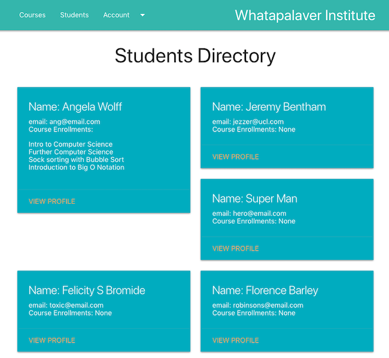
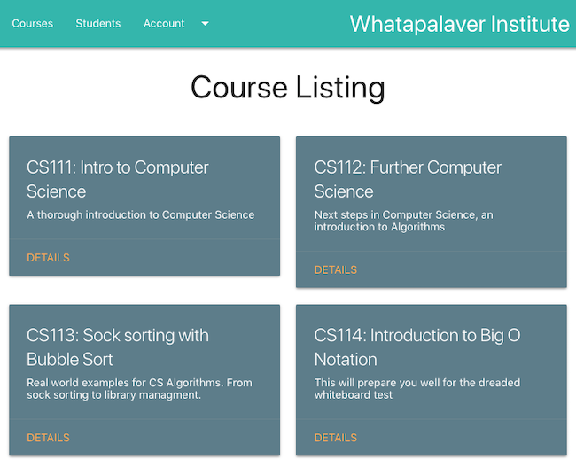

# Ruby on Rails - University App

This is a post-Makers project to reinforce my understanding of the Ruby on Rails framework. I don't plan to run tests for this experiment (shhhh!).

How to Run
-----

- clone this repo to your machine
- cd to the cloned directory
- run `bundle install` to install the dependancies
- Start local server by running `rails s`
- Open `localhost:3000` in browser.

Styling Choices
----

- [haml](http://haml.info/tutorial.html) for templating as it is super clean
- While haml is lovely and clean, it requires a translation from html and while I'm getting used to the new syntax a converter is really useful: [html to haml](https://html2haml.herokuapp.com/)
- And still on haml, when you actually decide the abstraction is really just an [irritant](https://opensoul.org/2011/11/30/haml-the-unforgivable-sin/), you are going to need another converter to get back to erb [haml2erb](https://haml2erb.org/).
- [Materialize](https://materializecss.com/) from google is the main css framework I'm using
- Also [tachyons](http://tachyons.io/docs/) for on the fly css adjustments as this is so intuitive

Screenshots:
-----

Rails Opinions Checklist:
------

*Because Rails is so opinionated, it can be handy to be reminded of the right way to do things....*

- Controller file names > snake_case, lowercase and plural eg courses_controller.rb  
- Class definition > CamelCase version of the controller file name eg. class CoursesController < ApplicationController  
- Views folder corresponding to controller eg courses  
- courses table (plural), Course model (Class - Capitalised and singular), course.rb model file (singular lowercase)  
